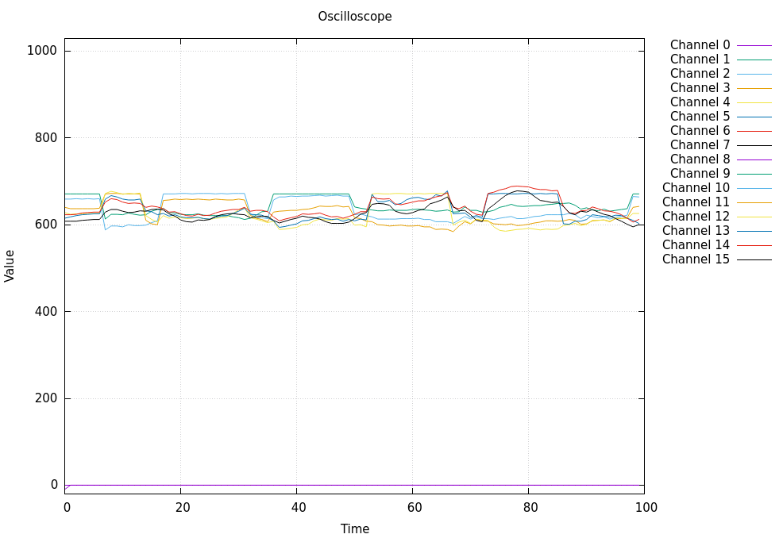

# Oscilloscope in Arduino AVR

This project is a simple oscilloscope using an Arduino board. The Arduino board reads the analog input and sends the data to the client via serial communication. The client displays the data in a graph.



## Features

You can configure the following parameters in the client:
- which channels are being sampled
- the sampling rate
- the sampling mode

The mode can be:
- continuous: the client receives the data as fast as possible
- buffered: the client receives the data in blocks of a fixed size

## Usage

```bash
git clone https://github.com/kristoji/arduino-oscilloscope
cd arduino-oscilloscope/src/server
make run
cd ../client
make run
```

If your Arduino board is not connected to `/dev/ttyUSB0`, you can change the port in the `src/server/avr.mk`.
